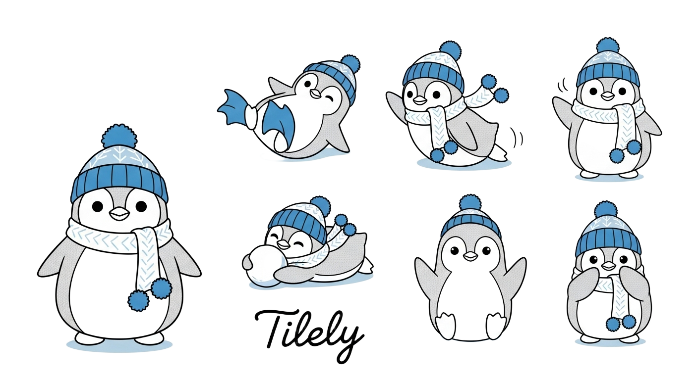

# Tilely

Tilely は動画や画像をタイル状にレイアウトして、ソーシャル投稿やプレゼン用のコラージュをサクッと作れる Web スタジオだよ。shadcn/ui ベースのミニマル UI に、ドラッグレスでも直感的に触れる編集パネルとタイムラインを詰め込んで、素材投入から書き出しまでワンフローで駆け抜けちゃう。🥳

## ✨ 主な特徴

- **タイルレイアウト即決**: 2×2 / 1×4 / 3×3 などのプリセットをワンクリックで切り替え。アスペクト比やガターもライブ調整できるよ。
- **セルごとのフィット&パン**: 選択セルに合わせてフィットモード、スケール、パン、音量ゲインを細かくコントロール。
- **タイムラインでサクッとトリム**: 各クリップの in/out と音量を同じパネルで調整。セル選択とも同期して迷子にならない UX。
- **オーディオバス管理**: マスターゲインとミュートを一括操作。BGM トラック向けのガイドも完備。
- **レンダリングフローの可視化**: ブラウザ／サーバどちらで書き出すかをキューイング。進捗や出力リンクをダッシュボード表示。
- **ローカルプロジェクト保存**: JSON でダウンロードすれば、再読み込みして続きからスタートできちゃう。

## 🛠️ スタック

| Layer | Tech |
| --- | --- |
| フレームワーク | Next.js 14 (App Router) |
| 言語 | TypeScript / React 18 |
| UI キット | Tailwind CSS, shadcn/ui, Radix UI, lucide-react |
| 状態管理 | Zustand + 永続化 (localStorage) |
| フィードバック | sonner (Toaster) |

## 🚀 使い方

1. `pnpm install` または `npm install` で依存関係をセットアップ。
2. `pnpm dev` / `npm run dev` でローカルサーバーを起動。
3. ブラウザで `http://localhost:3000` を開いて、Tilely スタジオに突入！
4. 左ペインに素材をドロップ → 中央キャンバスでプレビュー → 下部タイムラインでトリム。
5. 右ペインでレイアウトや音量を追い込んだら、トップバーの Export から書き出しプリセットを選んでエンコード開始。

> 💡 ffmpeg 実行はデモ用にキュー登録のみ。実装を繋げれば、wasm/サーバーレンダリングに即スイッチできる構成だよ。

## 🧭 ディレクトリ構成

```
app/                      # Next.js App Router エントリ
components/
  app-shell/              # アプリ全体のレイアウト構成
  canvas/                 # キャンバス / プレビュー系
  panels/                 # サイドパネル (アセット / プロパティ)
  timeline/               # タイムライン UI
  ui/                     # shadcn/ui ベースの再利用コンポーネント
lib/
  presets.ts              # レイアウトやエクスポートプリセット定義
  store.ts                # Zustand ストアとアセット変換ユーティリティ
  types.ts                # ドメインモデル型定義
  utils.ts                # 共通ユーティリティ
```

## 📡 レンダリングフロー (MVP)

1. トップバーの Export ボタンからブラウザ or サーバーレンダリングを選択。
2. `useProjectStore.queueRender` でレンダージョブを生成。
3. `PropertiesPanel` の「書き出し状況」アコーディオンに進捗が反映。
4. 出力 URL が届いたら、同パネルからワンクリックでダウンロード。

## 🔮 次の伸びしろアイデア

- ffmpeg.wasm / サーバーレンダリングの実ジョブ連携
- タイムラインの波形表示、マルチトラック BGM、フェード操作
- テンプレート共有やクラウド保存、AI レイアウト提案
- ショートカットカスタマイズ & マルチデバイス最適化

可愛い UI で直感操作、でもエディットはガチ。そんなギャップ盛りな Tilely をここから育てていこ〜！💅✨
